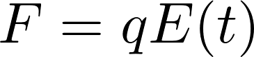
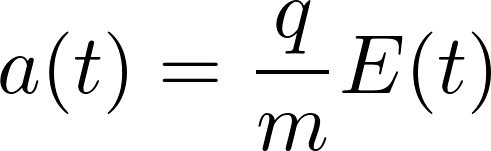
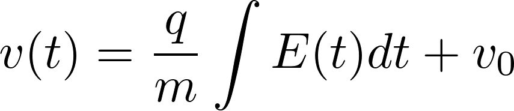
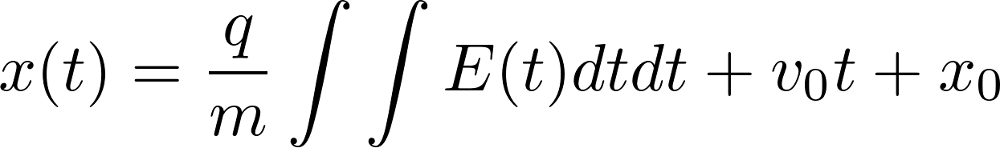

# Simple Mans Model

This is the implementation of the simple man's model to calculate the trajectories of electrons in laser fields.

## Newtons Equations

The force on a particle of mass m and acceleration a is defined by


For a particle of charge q in an time dependent electric field E(t), that force is equal to



Hence, one can write the acceleration as



Integrating this equation yields the velocity and the position.






# Usage of the script

In

```python3
if __name__ == '__main__':
```
edit the dictionary simulation_parameters at gusto

```python3
simulation_parameters = {'savename': 'Results/w3w/testnewcode.h5',
                        'timesteps': 1000,
                        'min/maxtime': 2050,
                        'npbins': 50,
                        'pmax': 3,
                        'phisteps': 25,
                        'phimax': 2,
                        'nI': 10,
                        'Atom': 'Argon'}
```

# ToDo

- [x] get parameters from list of atoms
- [x] make a init function for all user inputs
- [ ] changing ratio between the two beams
- [ ] put laser parameters in the input dictionary
- [ ] save all input parameters, i.e. simulation_parameters dictionary
