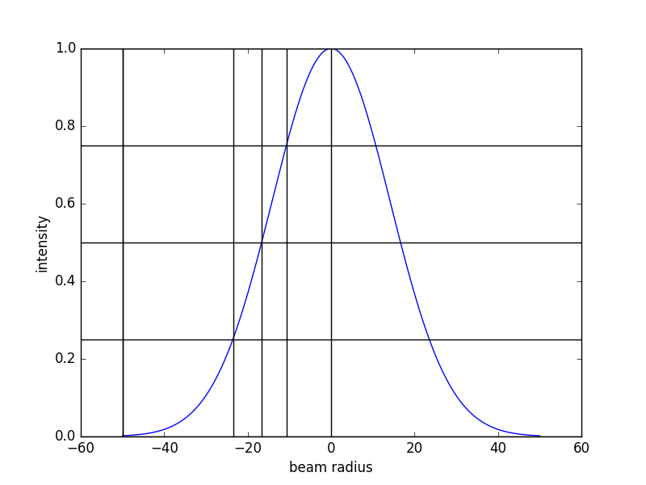
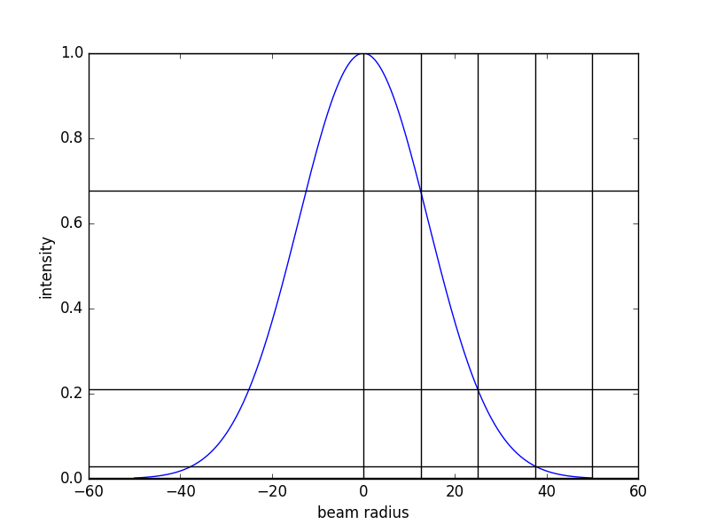

# Simple Mans Model

This is the implementation of the simple man's model to calculate the trajectories of electrons in laser fields.

## Newtons Equations

The force on a particle of mass m and acceleration a is defined by


For a particle of charge q in an time dependent electric field E(t), that force is equal to


Hence, one can write the acceleration as


Integrating this equation yields the velocity and the position.


# Difference in focus averaging

* The w3w.py script uses a focus average where the intensities are divided in equally spaced parts that are then are weighted by the respective volume of that intensity.
* The w3w_volume_avg.py script divides the focus cross section into equally spaced parts that are then also weighted by their respective volume





# Usage of the script

In

```python3
if __name__ == '__main__':
```
edit the dictionary simulation_parameters at gusto

```python3
simulation_parameters = {'savename': 'Results/w3w/testnewcode.h5',
                        'timesteps': 1000,
                        'min/maxtime': 2050,
                        'npbins': 50,
                        'pmax': 3,
                        'phisteps': 25,
                        'phimax': 2,
                        'nI': 10,
                        'Atom': 'Argon'}
```

For the w3w_volume_avg.py script also the laser parameters can be changed simply with a dictionary.

```python3
laser_parameters = {'Imax_red': 1.0E14,
                    't_red(fs)': 30,
                    'FWHM_red(um)': 23,
                    'Imax_uv': 1.2E13,
                    't_uv(fs)': 30,
                    'FWHM_uv(um)': 16}
```

# ToDo

- [x] get parameters from list of atoms
- [x] make a init function for all user inputs
- [x] changing ratio between the two beams
- [x] put laser parameters in the input dictionary
- [ ] put laser parameters in the input dictionary for w3w.py script
- [x] save all input parameters, i.e. simulation_parameters dictionary
- [ ] save the individual intensities or at least the ratio
- [ ] save the focus average volume
- [ ] verify that the volume focus average works as well as the intensity focus average
- [ ] is the volume average working correctly?
